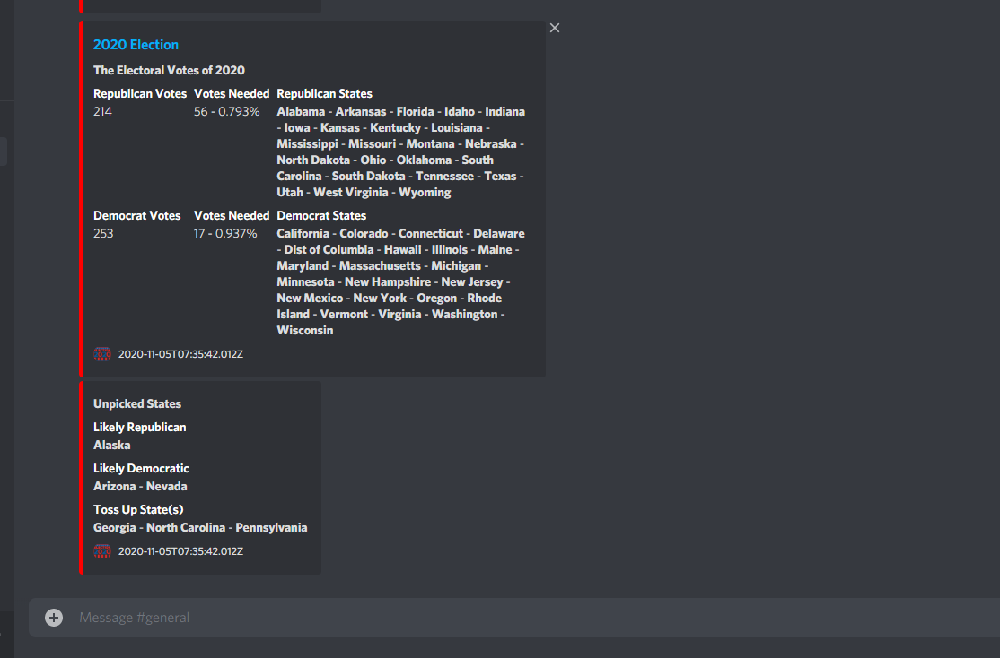

# Discord Webhook Election Stats

Discord webhook url
```css
WEBHOOK = URL
```

Sends data to channel about:
<ul>
    <li>Each Party Electoral Votes</li>
    <li>Each Party States</li>
    <li>Votes Needed for Each Party</li>
    <li>Unpicked States
        <ul>
            <li>Likely Republican</li>
            <li>Likely Democratic</li>
            <li>Toss Up States</li>
        </ul>
    </li>
</ul>



Dependencies:
<ul>
    <li><a href="https://www.npmjs.com/package/axios">Axios</a></li>
    <li><a href="https://www.npmjs.com/package/node-cron">node-cron</a></li>
    <li><a href="https://www.npmjs.com/package/dotenv">dotenv</a></li>
</ul>
